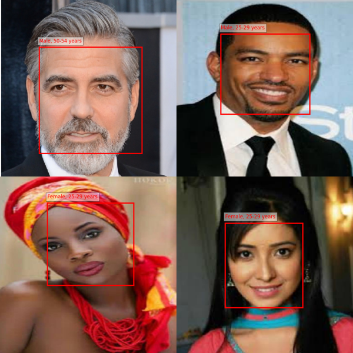

# FaceViT: A lightweight multitask Vision Transformer for face detection, age prediction and gender classification
FaceViT: A small-sized multi-task Vision Transformer for face detection, age estimation, and gender prediction, demonstrating the ability of the Vision Transformer to perform great across different tasks such as object detection and multiple classifications simultaneously.

# Dataset
For this project I have used the UTK Faces dataset, which you can download with a Kaggle account from here:
- [UTK Faces dataset](https://www.kaggle.com/datasets/yuulind/utk-cleaned/code)

**NOTE**: This dataset is heavily imbalanced when it comes to ages of people, while also containing a lot of relatively low quality images. This could be a limiting factor for performance over the different tasks.

# Some predictions

# Training time loss and metrics
### Loss plot 

### Metrics plot

**NOTE**: During this training experiment **no augmentations** were used.

# Evaluation metrics on validation set

| Metric Name           | Value   | Training Epochs |
|-----------------------|---------|--------|
| Top-3 Age Accuracy    | 61 %    | 43     |
| Face Bounding Box MSE | 0.0054  | 43     |
| Gender Accuracy       | 75 %    | 43     |

